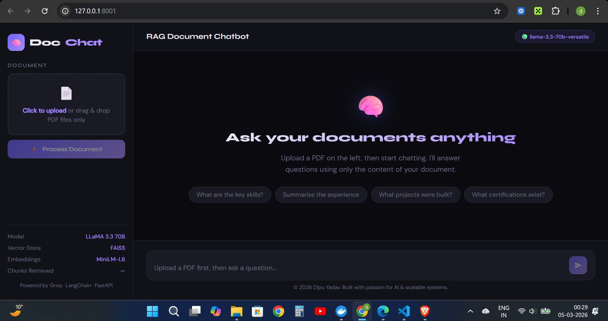
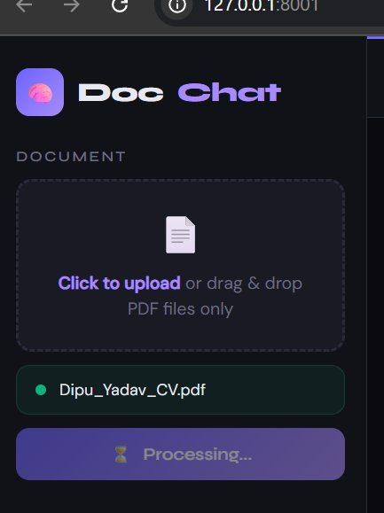
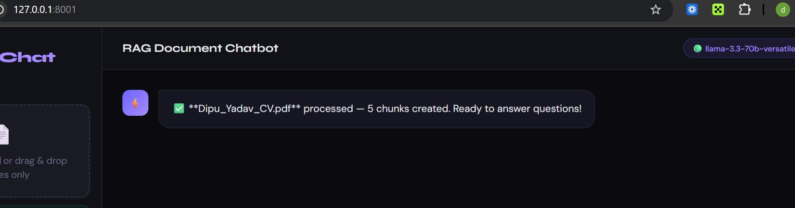
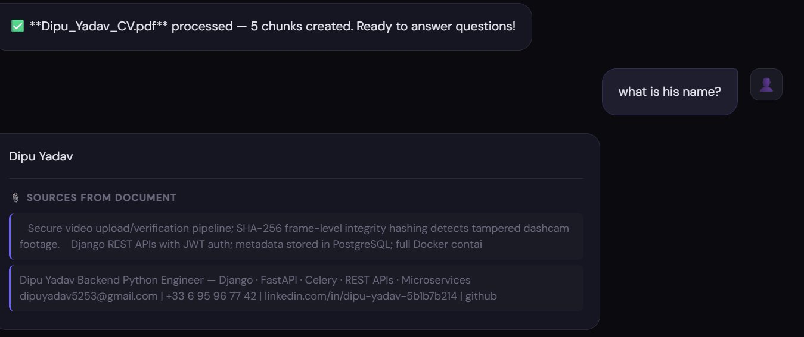
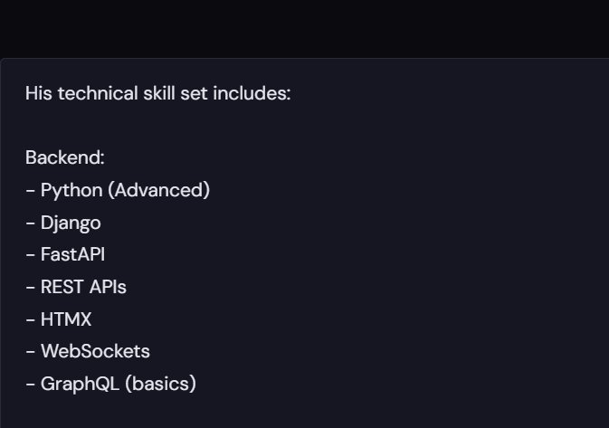
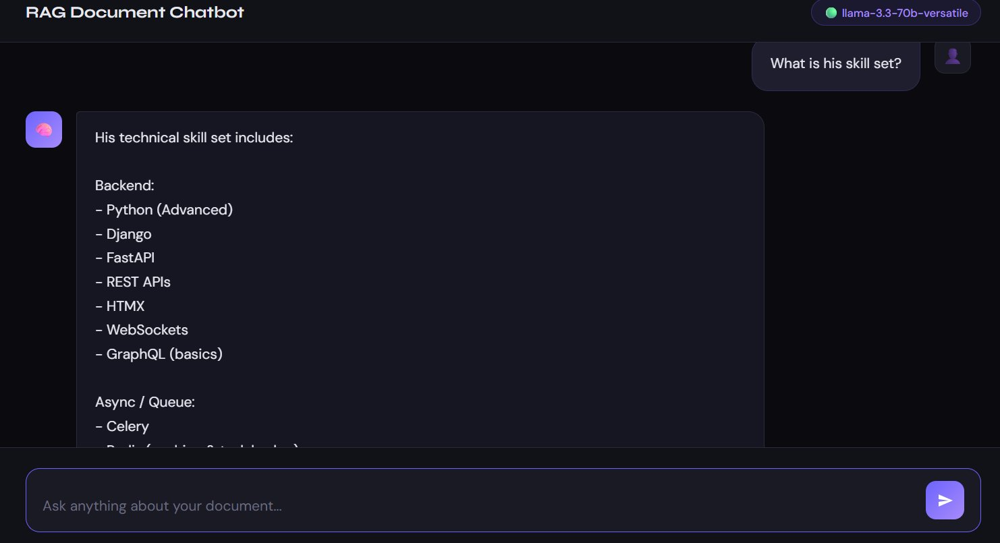
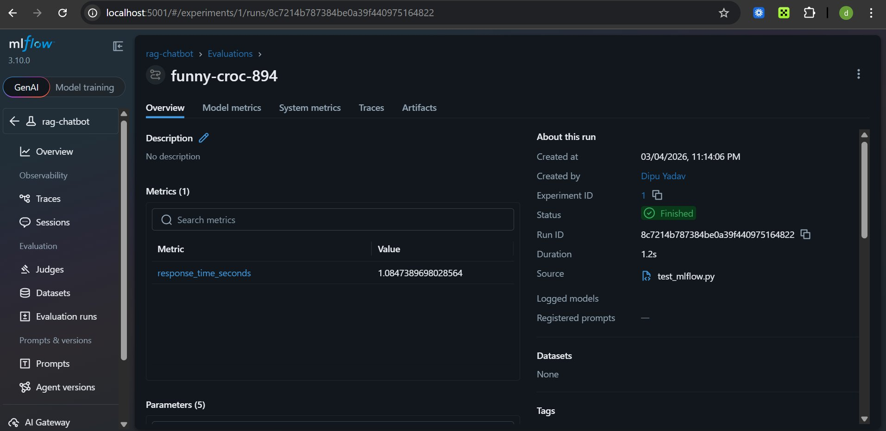

# 🧠 DocChat — RAG Document Chatbot

<div align="center">

**Ask questions about any PDF document using AI**
*Powered by LangChain · FAISS · Groq LLaMA 3.3 70B · FastAPI · MLflow · Docker*

[](https://python.org)
[](https://fastapi.tiangolo.com)
[](https://langchain.com)
[](https://docker.com)
[](https://mlflow.org)

[🔗 Live Demo](https://rag-document-chatbot.onrender.com) · [📋 API Docs](https://rag-document-chatbot.onrender.com/docs) · [👤 LinkedIn](https://www.linkedin.com/in/dipu-yadav-5b1b7b214/)

</div>

---

## 🖼️ Screenshots

### 1. Chat Interface — Home Screen

> Dark-themed ChatGPT-style UI — model info sidebar, FAISS & embedding details, and quick suggestion chips.

---

### 2. PDF Upload — Processing in Progress

> Select or drag & drop a PDF. Live processing state shown with filename confirmation.

---

### 3. Document Successfully Processed

> Instant feedback — PDF chunked, embedded, and indexed into FAISS. Ready for questions.

---

### 4. Live Q&A — Answer with Source Citations

> Question: *"What is his name?"* — Answer extracted directly from document with source chunks shown.

---

### 5. Skill Set Extraction — Zoomed View

> Detailed answer pulled from the exact document sections — no hallucination, strictly document-grounded.

---

### 6. Full Skill Set Answer

> Question: *"What is his skill set?"* — Structured answer covering Backend, Async/Queue, Databases and more.

---

### 7. MLflow Experiment Tracking Dashboard

> Every query tracked — response time 1.08s, model used, parameters, run status. Full MLOps pipeline.

---

## 📖 What is DocChat?

DocChat is a **production-ready Retrieval-Augmented Generation (RAG) chatbot** that lets you upload any PDF and ask questions about it in natural language. Instead of hallucinating, it retrieves the most relevant sections from your document and uses **Groq LLaMA 3.3 70B** to generate accurate, grounded answers.

Built in **10 days at 1–2 hours/day** as a real-world ML engineering project by a final-year M.Sc. Software Engineering student at ESIGELEC France.

---

## ✨ Features

- 📄 **PDF Upload** — drag & drop or click to upload any PDF
- 🔍 **Semantic Search** — FAISS finds the top 6 most relevant chunks
- 🤖 **LLaMA 3.3 70B** — state-of-the-art free LLM via Groq API
- 📊 **MLflow Tracking** — response time, model, parameters all logged
- ⚡ **FastAPI Backend** — REST API with full Swagger docs
- 🐳 **Docker Ready** — one command runs the full stack
- 🌐 **Live Deployed** — hosted on Render
- 🎨 **Beautiful UI** — dark ChatGPT-style interface

---

## 🏗️ Architecture

```
┌─────────────┐     ┌──────────────┐     ┌─────────────────┐
│  PDF Upload │────▶│  LangChain   │────▶│  FAISS Vector   │
│  (FastAPI)  │     │  Text Split  │     │     Store       │
└─────────────┘     └──────────────┘     └────────┬────────┘
                                                   │
User Question ─────▶  HuggingFace Embeddings       │ Semantic Search
                           │                       ▼
                           └──────────────▶  Top 6 Chunks
                                                   │
                                                   ▼
                                       ┌─────────────────────┐
                                       │  Groq LLaMA 3.3 70B │
                                       └──────────┬──────────┘
                                                  │
                          MLflow Tracking ◀────────┤
                                                  ▼
                                            Final Answer
```

---

## 🛠️ Tech Stack

| Layer | Technology | Purpose |
|---|---|---|
| **LLM** | Groq — LLaMA 3.3 70B | Fast, free inference |
| **RAG Framework** | LangChain 0.2 | Pipeline orchestration |
| **Vector Store** | FAISS (Meta) | Semantic similarity search |
| **Embeddings** | HuggingFace MiniLM-L6-v2 | Text to vectors |
| **API** | FastAPI + Uvicorn | REST backend |
| **Tracking** | MLflow 3.10 | Experiment management |
| **Container** | Docker + Docker Compose | Deployment |
| **Cloud** | Render | Free hosting |
| **Frontend** | HTML / CSS / JS | ChatGPT-style UI |

---

## 🚀 Quick Start

### Option 1 — Docker (Recommended)

```bash
git clone https://github.com/DipuYadav5253/RAG-Document-Chatbot-LangChain-Vector-DB
cd RAG-Document-Chatbot-LangChain-Vector-DB
cp .env.example .env
# Add your GROQ_API_KEY and HF_TOKEN to .env
docker-compose up --build
```

Open [http://localhost:8001](http://localhost:8001) 🎉

---

### Option 2 — Local

```bash
git clone https://github.com/DipuYadav5253/RAG-Document-Chatbot-LangChain-Vector-DB
cd RAG-Document-Chatbot-LangChain-Vector-DB
python -m venv venv
venv\Scripts\activate       # Windows
source venv/bin/activate    # Mac/Linux
pip install -r requirements.txt
cp .env.example .env
uvicorn app.main:app --reload --port 8001
```

---

## 🔑 Environment Variables

```bash
GROQ_API_KEY=gsk_your_key_here    # console.groq.com — Free
HF_TOKEN=hf_your_token_here       # huggingface.co — Free
```

---

## 📡 API Endpoints

| Endpoint | Method | Description |
|---|---|---|
| `/` | GET | Chat UI |
| `/health` | GET | Server status |
| `/upload-pdf` | POST | Upload & process PDF |
| `/ask` | POST | Ask a question |
| `/ask-tracked` | POST | Ask with MLflow tracking |
| `/docs` | GET | Swagger UI |

---

## 📊 MLflow Tracking

Every query tracked: response time, model name, chunk count, answer length.

```bash
mlflow ui --backend-store-uri sqlite:///mlruns/mlflow.db --port 5001
```

---

## 📁 Project Structure

```
rag-chatbot/
├── app/
│   ├── main.py              ← FastAPI app + UI serving
│   ├── rag_pipeline.py      ← RAG pipeline + MLflow
│   └── embeddings.py        ← FAISS vector store
├── static/
│   └── index.html           ← Chat UI
├── screenshots/             ← README screenshots
├── docs/                    ← PDF uploads
├── Dockerfile
├── docker-compose.yml
├── render.yaml
├── requirements.txt
└── .env.example
```

---

## 👤 Author

**Dipu Yadav** — M.Sc. Software Engineering, ESIGELEC France

[](https://www.linkedin.com/in/dipu-yadav-5b1b7b214/)
[](https://github.com/DipuYadav5253)
[](mailto:dipuyadav5253@gmail.com)

*Open to Backend Python & ML Engineering internship — France, June 2026*

---

<div align="center">
Built with ❤️ using Python, LangChain and Groq
<br><br>
⭐ <b>Star this repo if you found it useful!</b>
</div>
